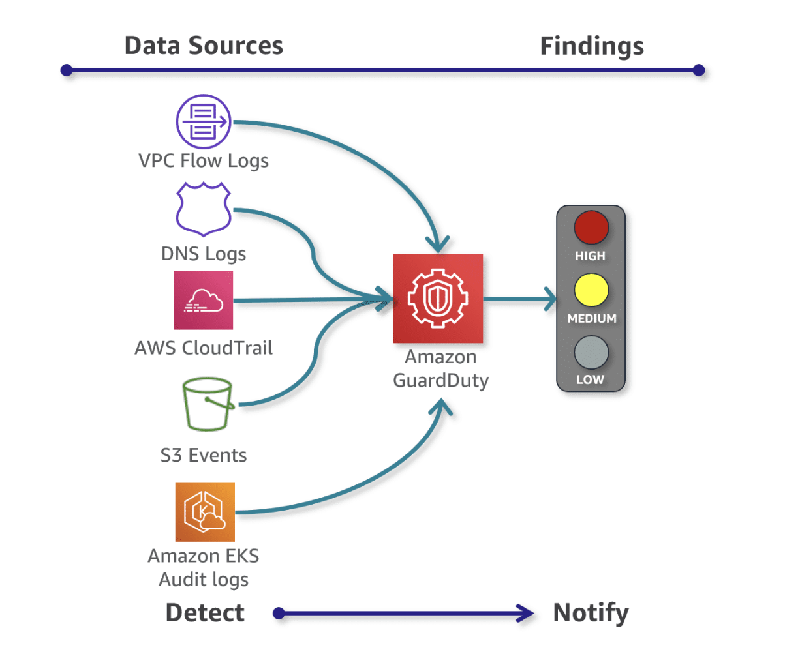
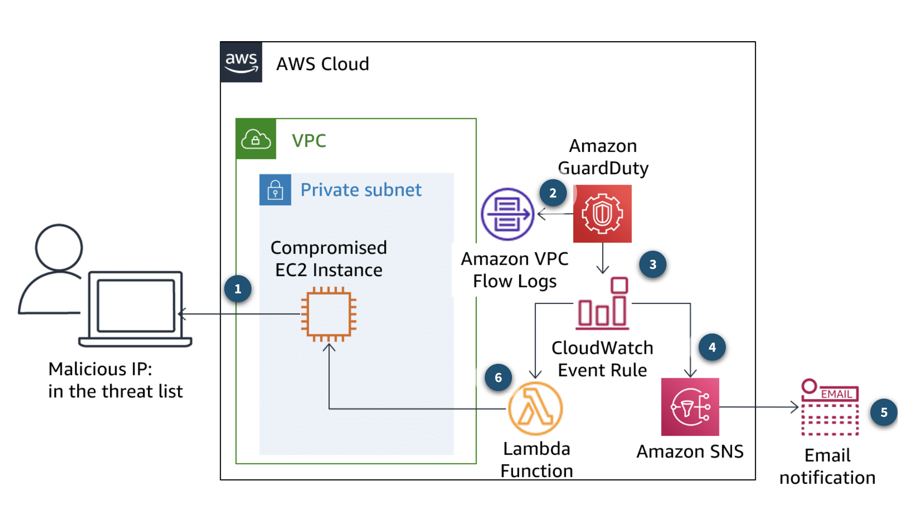
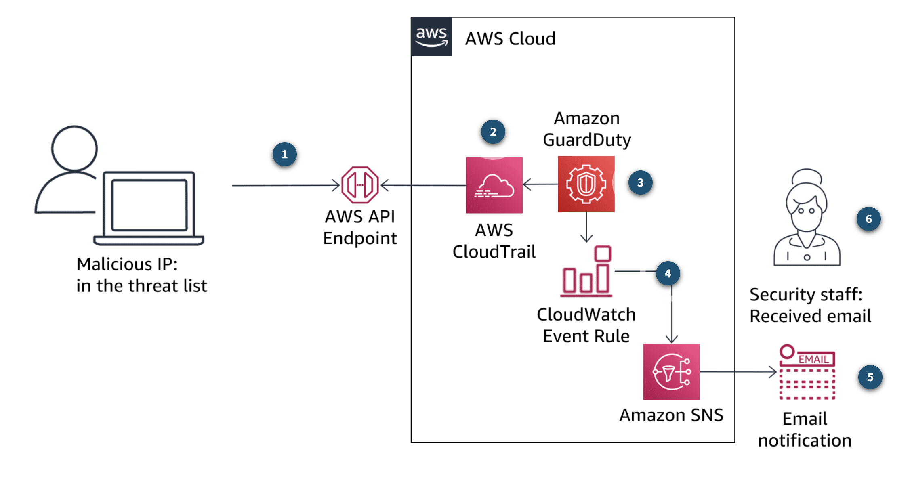

# 💂 AWS GuardDuty

O AWS GuardDuty é um serviço totalmente gerenciado pela AWS e regional que análisa logs do CloudTrail, VPC Flows Logs, DNS Logs, S3 Events e EKS Logs para identificar atividades incomuns em suas contas.

Quando o GuardDuty detecta um problema de segurança, ele gera a “Security Finding”. Um “finding” possui detalhes que podeM ajudar você a investigar o problema. Cada security finding é classificado em um nível de gravidade (Low, Medium ou High).

> Lembre-se: o GuardDuty é um serviço regional, portanto, ele deve ser habilitado em cada região que você deseja monitorar.

## Que tipos de ameaças o GuardDuty pode detectar?

O GuardDuty analisa continuamente o ambiente da nuvem e pode fornecer alertas de uma série de ameaças que você pode enfrentar, como comprometimento de instância, comprometimento de conta, comprometimento de bucket e comprometimento de cluster do Amazon EKS:

- **Reconhecimento (reconnaissance)**: reconhecimento de atividades comuns feitas por hackers, como chamadas incomuns de APIs, padrões incomuns de solicitações de login com falha, varredura de porta intra-VPC, etc.
- **Comprometimento de instância (instance compromise)**: mineração de criptomoedas, atividade de negação de serviço de saída, alto volume de tráfico de rede incomum, protocolos de redes incomuns, comunicação de instância de saída com um IP malicioso conhecido, etc.
- **Comprometimento de conta (account compromise)**: chamadas de APIs de areas incomuns ou proxy anonimizado, tentativas de desativação do CloudTrail, deployments em regiões incomuns (não usadas geralmente) e chamadas APIs de IPs maliciosos conhecidos.
- **Comprometimento de bucket (bucket compromise)**: tentativas de acesso não autorizado ao S3 usando IPs maliciosos conhecidos, chamadas de APIs com um usuário que nunca acessou o bucket ou acesso de uma localização incomum, etc.

## Casos de Usos

Alguns exemplos práticos de como o GuardDuty identifica ameças, gera os findings e executa alguns actions-itens.

### Comprometimento de instância EC2

1. Quando um IP começa a fazer tentativas de acesso em uma instância EC2 e este IP está na lista de IPs maliciosos recentemente adicionado no GuardDuty;
2. Os logs de comunicação entre a instância EC2 e o IP malicioso é registrado nos logs da VPC Flows Logs (os quais são monitorados pelo GuardDuty);
3. GuardDuty gera um “finding” com base nos logs da VPC Flows Logs e exibe no console do GuardDuty, além de enviar para o CloudWatch Events;
4. Um evento do CloudWatch aciona um tópico do SNS (Simple Notification Service) e uma função Lambda;
5. O tópico SNS é consumido e dispara um e-mail ao time de segurança
6. A função Lambda vai isolar a instância comprometida para que ela não receba mais reauisições. O security group da instância passe a ser **ForensicSecurityGroup**

### Comprometimento de credencias do IAM

1. O host com IP malicioso começa fazer requisições à APIs usando chaves IAM válidas. Este IP está na lista de IPs maliciosos;
2. O CouldTrail registra todos os logs de chamadas de APIs;
3. GuardDuty analisa os logs do CloudTrail e gera um “finding” nomeado como **UnauthorizedAccess:IAMUser/MaliciousIPCaller.Custom**, que representa uma tentativa de acesso a recursos usando um IP malicioso. Além do GuardDuty exibir o “finding” no console, também envio ao CloudWatch;
4. Os eventos do CloudWatch acionam um tópico SNS;
5. Este tópico SNS é consumido e envia um e-mail ao time de segurança.