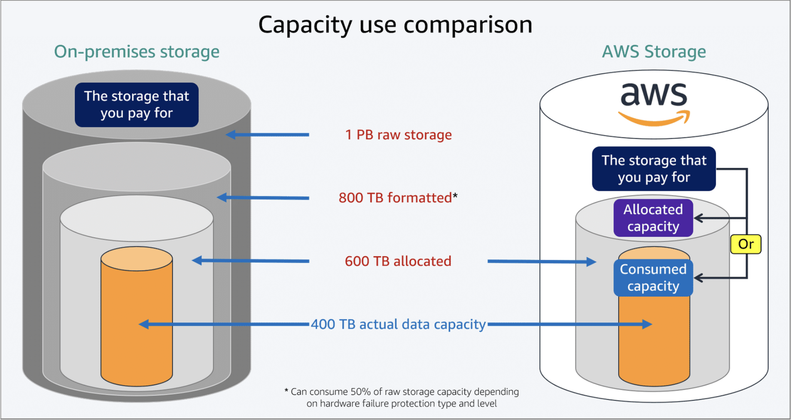
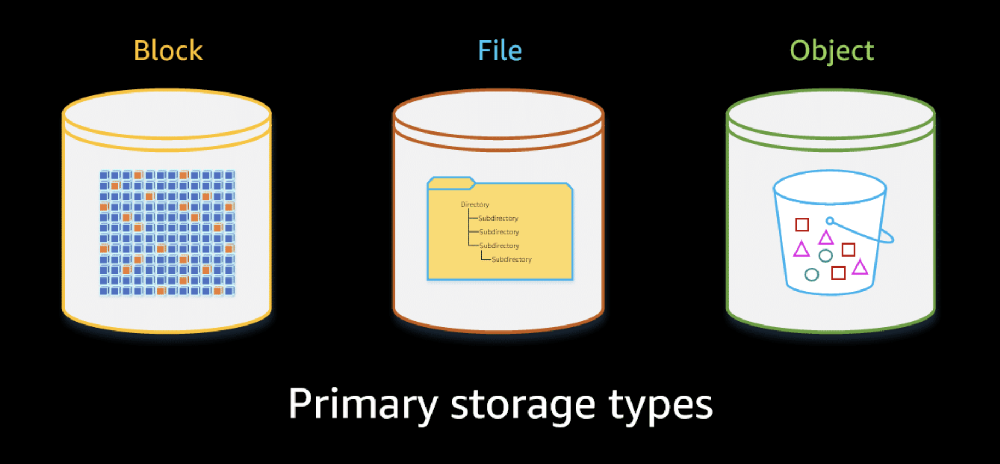

# 🎲 AWS Storage Services

Storage capacity usage between on-premises Vs Cloud:

No on-premise é necessário comprar a capacidade total que você espera que seu sistema use. Já na nuvem, você paga somente paga o que usa, sem desperdício ou recursos oceosos. 

## Primary storage types

## File storage

Provides a shared file system with directories and files.

Key characteristics:
- Hierarchical structure (folders/files)
- Supports file locking
- Accessible by multiple instances at the same time
- Mounted over the network

Best for:
- Shared application data
- Content management systems
- Home directories
- Lift-and-shift applications

AWS service example: 
- Amazon Elastic File System (EFS)

## Block storage

Provides raw storage volumes that behave like physical disks attached to a server.

Key characteristics:
- Low latency
- High performance
- Data is divided into fixed-size blocks
- Typically attached to a single instance

Best for:
- Databases
- Operating systems
- Transactional workloads
- Applications requiring consistent IOPS

AWS service example:
- Amazon Elastic Block Store (EBS)

## Object storage

Stores data as objects (data + metadata + unique ID) inside buckets.

Key characteristics:
- Massively scalable
- Highly durable
- Accessed via HTTP/HTTPS (API-based)
- No traditional file system hierarchy (folders are logical)

Best for:
- Backups and archives
- Data lakes and analytics
- Static website hosting
- Media files (images, videos)

AWS service example:
- Amazon S3