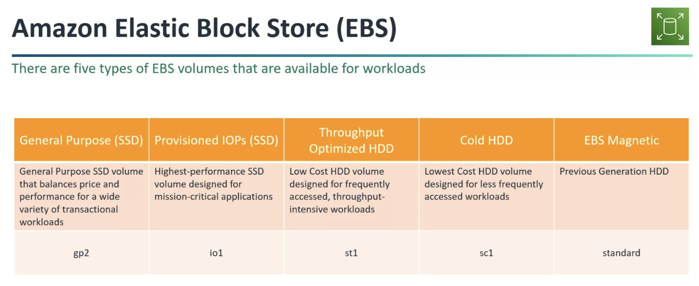
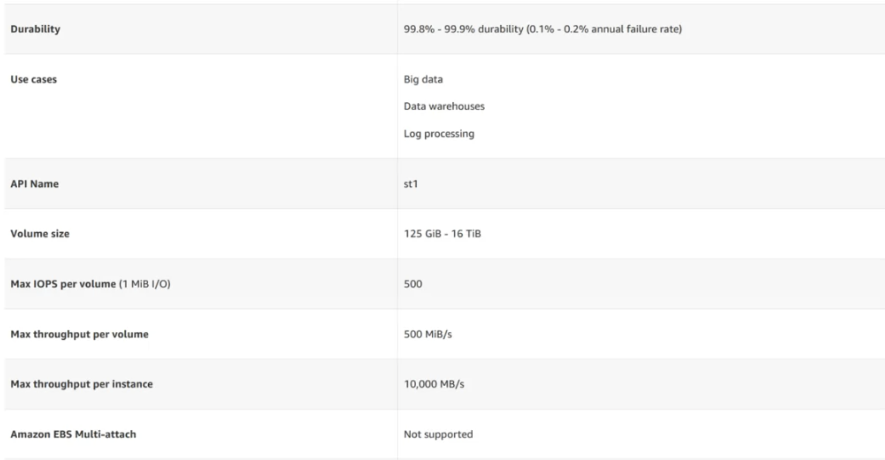

# 💿 Elastic Block Store (EBS)

Elastic Block Store (EBS) é um serviço de storage com foca em performance, já que este tipo de storage é o mais próximo da instância EC2, quando comparado com EFS e S3 (que são serviços regionais).

## Tipos de EBS

### Provisioned IOPS - SSD

### Provisioned IOPS - SSD

> Apenas SSD podem ter EBS Multi Attach

### Cold HDD

### EBS - Magnetic

